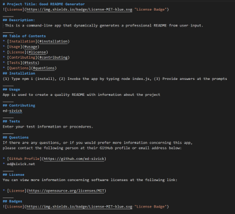
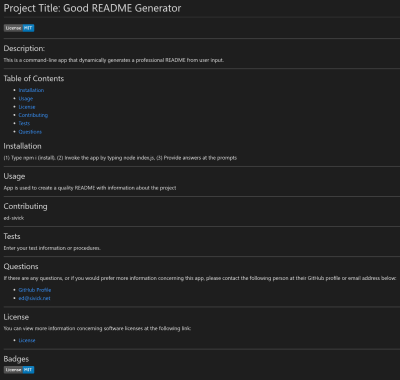

# README_generator
___ 
## Objective
Create a command-line application that dynamically generates a professional README file from a user's input using the Inquirer package. The application will be invoked with the following command: **node index.js**.
___
## generateMarkdown.js
The **generateMarkdown(data)** function utilizes a **const readmeData** variable to create the **generateMarkdown module**.  This is used as the template for the created newREADME file containing the user responses from the Inquirer npm package.    
___
## index.js
The

___
## Summary
Below is the user defined newReadme file:

# Project Title: Good README Generator
_____
## Description:
 This is a command-line app that dynamically generates a professional README from user input.
_____
## Table of Contents
* [Installation](#installation)
* [Usage](#usage)
* [License](#license)
* [Contributing](#contributing)
* [Tests](#tests)
* [Questions](#questions)
## Installation
(1) Type npm i (install), (2) Invoke the app by typing node index.js, (3) Provide answers at the prompts
_____
## Usage
App is used to create a quality README with information about the project
_____
## Contributing
ed-sivick
_____
## Tests
Enter your test information or procedures.
_____
## Questions
If there are any questions, or if you would prefer more information concerning this app,
please contact the following person at their GitHub profile or email address below:

* [GitHub Profile](https://github.com/ed-sivick)
* ed@sivick.net
_____
## License
You can view more information concerning software licenses at the following link:

* [License](https://opensource.org/licenses/MIT)
_____
## Badges

___
## Application Links and Images  
**Links:**
Walkthrough Video (MP4): (https://drive.google.com/file/d/1fewA1GE0Cne1eKPY8fObZVR_X5hGL9aI/view?usp=sharing)

**Application Image Examples:** Hover the mouse over each image for a brief description.

  
  
  
  

  

  